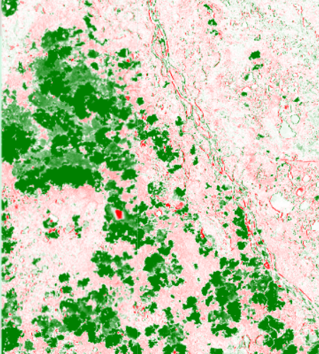
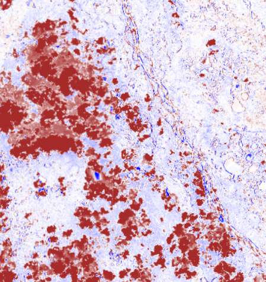
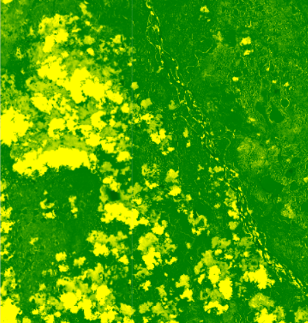
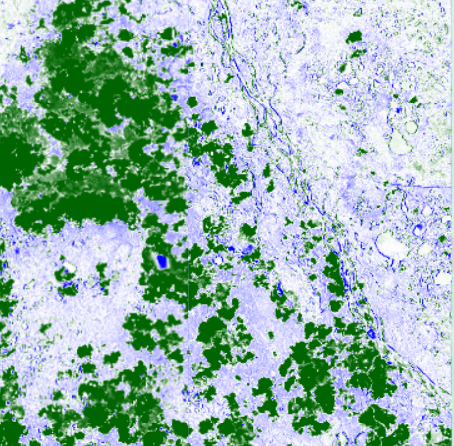
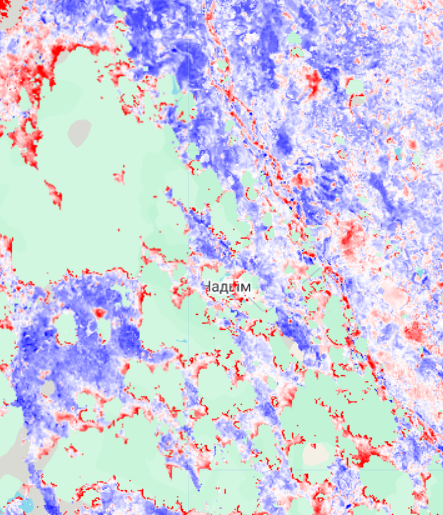
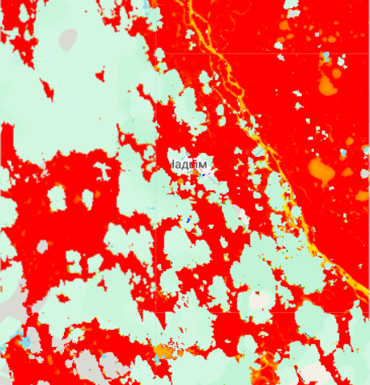
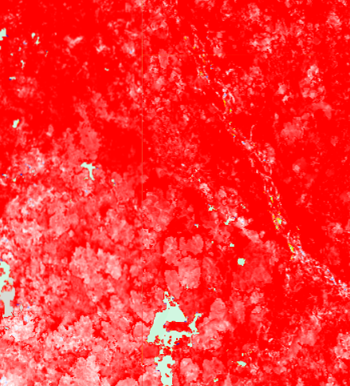
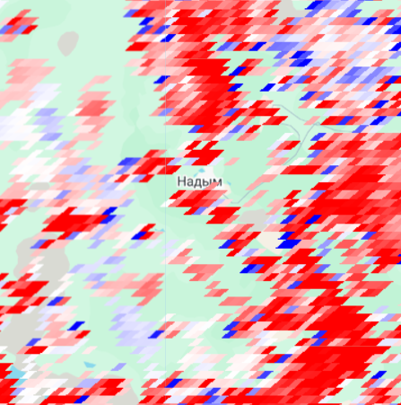
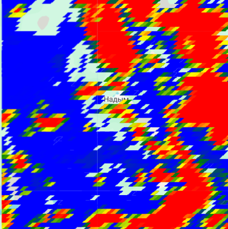

# Сбор датасетов для классификации вечной мерзлоты

## Характеристики спутников

### Landsat

Каналы:
- Синий (B2) — 0.45–0.51 мкм
- Зелёный (B3) — 0.53–0.59 мкм
- Красный (B4) — 0.64–0.67 мкм
- Ближний инфракрасный (B5) — 0.85–0.88 мкм
- Коротковолновый инфракрасный (B6, B7) — 1.57–2.29 мкм
Разные объекты по-разному отражают свет в этих диапазонах.
Индексы — это математические комбинации каналов, которые усиливают нужные свойства поверхности и подавляют ненужные.
## Индексы
### NDVI

*NDVI (Normalized Difference Vegetation Index) — нормализованный относительный индекс растительности*

**Формула**
```
NDVI = (NIR - Red) / (NIR + Red)
```
**Где**:
- NIR — ближний инфракрасный канал (SR_B5)
- Red — красный канал (SR_B4)

**Физический смысл**
- Здоровые растения сильно отражают NIR (клеточная структура листьев) и поглощают красный свет (хлорофилл) → NIR большое, Red малое → NDVI → +1
- Голая почва, скалы — примерно одинаково отражают оба канала → NDVI около 0
- Вода, снег, облака — NIR поглощается, Red отражается → NDVI отрицательный

 **Диапазон значений**
От -1 до 1

**Интерпретация:** 
< 0 Вода, снег, лёд, облака
0 - 0.1 Пустыни, голые скалы, песок
0.1 - 0.3   Редкая растительность, кустарники, тундра
0.3 - 0.6   Средняя растительность (луга, редкий лес)
0.6 - 1 Густая зелёная растительность (тайга, джунгли)

- Отслеживание "позеленения Арктики" — увеличения NDVI в тундре из-за потепления
- Обнаружение термокарста — провалы почвы меняют растительность
- Картографирование границы леса и тундры
- Оценка биомассы и продуктивности экосистем

Синий — вода/снег
Белый/бежевый — почва
Зелёный — растительность

Для NDVI часто используют палитру от коричневого (почва) через жёлтый к зелёному (густая растительность).
**Пример**
*Окресности города Надым*
Разница 2020/2023

### NDWI

Существует две основные версии индекса. Не путать!
#### Вариант 1: Классический водный индекс (для открытой воды)

*Нормализованный разностный водный индекс (NDWI) (Normalized Difference Water Index) — индекс, который используется для выявления водных тел в спутниковых или аэрокосмических изображениях.*

**Формула Макфеетерса (McFeeters, 1996):**  
```
NDWI = (Green - NIR) / (Green + NIR)
```

- Green — зелёный канал (SR_B3)
- NIR — ближний инфракрасный (SR_B5)

**Что показывает**
Вода: Green ↑ (немного отражает), NIR ↓ (сильно поглощает) → NDWI положительный
Растительность/почва: Green ↓, NIR ↑ → NDWI отрицательный

**Применение**

- Мониторинг обводнённости (для термокарстовых озёр идеально)
- Выделение рек, озёр, водохранилищ
- Отслеживание паводков
**Пример**

#### Вариант 2: Индекс влажности растительности (для воды в листьях)

*NDMI (Normalized Difference Moisture Index) — индекс влажности растительности, который используется для оценки и мониторинга содержания влаги в растениях.* 

**Формула Гао (Gao, 1996):**
```
NDWI = (NIR - SWIR1) / (NIR + SWIR1)
```

- NIR — ближний инфракрасный (SR_B5)
- SWIR1 — коротковолновый инфракрасный (SR_B6)

**Что показывает**
Вода в растительности (влага в листьях) и влажность почвы. SWIR1 чувствителен к содержанию воды.

**Применение**
- Влажность почвы
- Для мерзлоты: показывает участки с переувлажнением, болота
- Оценка засухи и стресса растений
- Риск пожаров (сухая растительность)

### SAVI

*SAVI (Soil Adjusted Vegetation Index) — индекс растительности с коррекцией по почве.* 

**Формула**
```
SAVI = ((NIR - Red) / (NIR + Red + L)) * (1 + L)
```

- L — поправочный коэффициент на яркость почвы (от 0 до 1)

 **Зачем нужен**
 
В районах с разреженной растительностью (тундра, полупустыни) NDVI "врёт", потому что на него влияет яркость почвы. Тёмная почва занижает NDVI, светлая — завышает. SAVI вводит поправку L, которая учитывает этот эффект.

Выбор коэффициента L
- L Для какой растительности
- 0 Очень густая (экваториальный лес) — фактически NDVI
- 0.25  Средняя
- 0.5   Разреженная (саванна, кустарники) — стандарт
- 0.75-1    Очень редкая (пустыни, тундра)

- Для тундры оптимально L = 0.2 или 0.3, потому что растительность низкая, но почва часто тёмная.

**Интерпретация**
Значения SAVI обычно ниже NDVI при том же покрытии, но более достоверны для разреженной растительности. Диапазон тоже от -1 до 1, но реальные значения редко превышают 0.7.
- Более точная оценка растительности в тундре и лесотундре
- Мониторинг кустарниковой тундры (кусты дают низкое покрытие, но важны для экологии)
- Участки с пятнистым почвенным покровом
SAVI — похож на NDVI, но учитывает почву.

### LST 

*Температура поверхности земли*

**Как рассчитывается**

LST — это температура верхнего слоя земной поверхности (почва, растительность, снег, вода), измеренная спутником в инфракрасном диапазоне. Она не равна температуре воздуха, но тесно с ней связана.

В GEE LST доступна как готовый продукт (MODIS, Landsat, Sentinel-3), но есть и формула

**Формула (для тепловых каналов):**
```
LST = f(Lλ, ε, τ, Tатм)
```
где:
- `Lλ` — излучение, регистрируемое спутником,
- `ε` — эмиссивность поверхности (способность излучать тепло, зависит от материала и растительности),
- `τ` — атмосферное пропускание,
- `Tатм` — вклад атмосферы.

В готовых продуктах (MODIS, Landsat Collection 2 Level-2) эти поправки уже внесены, и пользователь получает LST в кельвинах.


- **Среднегодовая LST** — базовый индикатор: если среднегодовая LST ниже 0°C, мерзлота вероятна.        
- **Средняя за вегетационный сезон (июнь–август)** — показывает летний прогрев.
- **Средняя за зимний период (декабрь–февраль)** — для оценки зимнего охлаждения.
- **Сезонная амплитуда** = LST_max_лето – LST_min_зима.
- **Продолжительность периода с LST > 0°C** (длина сезона оттаивания).
- **Индекс оттаивания** (сумма градусо-дней выше 0°C) 

**Интерпретация**

| Параметр               | Значение        | Интерпретация                                                      |
| ---------------------- | --------------- | ------------------------------------------------------------------ |
| **Среднегодовая LST**  | < -5°C          | Сплошная мерзлота (зона арктических пустынь, северная тундра)      |
|                        | -5°C … 0°C      | Прерывистая и островная мерзлота (лесотундра, северная тайга)      |
|                        | > 0°C           | Сезонная мерзлота или её отсутствие (южная тайга, смешанные леса)  |
| **Сезонная амплитуда** | > 30°C          | Континентальный климат, сильное промерзание зимой и прогрев летом  |
|                        | < 20°C          | Морской климат, меньшая изменчивость, часто — прерывистая мерзлота |
| **Индекс оттаивания**  | < 500 °C·дни    | Сплошная мерзлота, активный слой тонкий                            |
|                        | 500–1500 °C·дни | Прерывистая мерзлота                                               |
|                        | > 1500 °C·дни   | Сезонная мерзлота или её отсутствие                                |
LST сильно зависит от типа поверхности. Например, болота и торфяники могут иметь более высокую летнюю LST, чем соседние леса, из-за низкой теплопроводности. Поэтому LST всегда нужно интерпретировать в связке с другими признаками (NDVI, влажность, тип грунта).

**Тренды LST во времени**  
Устойчивый рост LST за последние десятилетия — ключевой индикатор деградации вечной мерзлоты. По данным MODIS и Landsat можно строить временные ряды и вычислять линейный тренд с помощью `ee.Reducer.linearFit()`.
**Пример**

Данное изображение яркий пример проблемы источника данных, в данном случае были некорректные данные за 2020 год

При смене года на 2021 картина налаживается

### ALT 

*Глубина сезонного оттаивания*

**Как рассчитывается**
Базовая формула модели Стефана:
```
ALT = sqrt( (2 * k * T) / Q )
```
где:
- `ALT` — глубина сезонного оттаивания (м),
- `k` — коэффициент теплопроводности мёрзлого/талого грунта (Вт/м·К),
- `T` — сумма положительных температур на поверхности за период оттаивания (°C·дни),
- `Q` — объёмная теплота фазового перехода (льдистость × скрытая теплота плавления), Дж/м³.

На практике, если известны только данные о температуре и снежном покрове, часто используют упрощённую эмпирическую формулу, где `T` заменяется на **индекс таяния** (сумма градусо-дней выше 0°C), а `k/Q` заменяется на эмпирический коэффициент `C`, который подбирается по типу грунта и растительности:

```
ALT = C * sqrt(Т)
```
- `C` — эмпирический коэффициент (зависит от грунта, влажности, растительности). Для тундровых почв часто принимается `C = 0.05–0.07` (в м/√°C·дни).
- `Т` — сумма градусо-дней оттаивания (температура воздуха или поверхности > 0°C).

**Интерпретация**
- Глубина активного слоя — один из диагностических признаков. Сплошная мерзлота обычно имеет ALT < 0.5–1 м, прерывистая — больше, а в зонах, где мерзлота отсутствует, ALT не рассчитывается (нет многолетнемёрзлого основания).
- Увеличение ALT сигнализирует о деградации мерзлоты, что важно для прогнозирования просадок грунтов, выбросов парниковых газов, изменения гидрологии.
- Изменчивость ALT от года к году показывает отклик мерзлоты на климатические аномалии. 

**Выбор параметров и данных**

| Параметр                          | Источник в GEE                                  | Примечания                                                                                                        |
| --------------------------------- | ----------------------------------------------- | ----------------------------------------------------------------------------------------------------------------- |
| **Температура поверхности (LST)** | MODIS MOD11A2 (дневная), Landsat (расчёт LST)   | Используется, если нужна именно поверхностная температура. Для модели Стефана корректируют на наличие снега.      |
| **Температура воздуха**           | ERA5-Land, ERA5                                 | Более гладкие временные ряды, легче агрегировать, но хуже отражают локальные эффекты (рельеф, растительность).    |
| **Снежный покров**                | MODIS MOD10A1, ERA5-Land (snow_cover)           | Дни со снегом исключаются из суммы градусо-дней, так как снег изолирует грунт.                                    |
| **Коэффициент C (или k/Q)**       | Табличные значения по типам почв/растительности | Можно использовать карты почв (SoilGrids) или наземные наблюдения. Для региональных оценок часто берут константу. |

**Выбор эмпирического коэффициента C:**

- Минеральные грунты (пески, супеси): `C = 0.045–0.06`
    
- Торфяники, органические грунты: `C = 0.07–0.12`
    
- Залесённые территории: `C` может быть ниже из-за затенения и подстилки.
    

Для тундры обычно используют `C = 0.07–0.09`.

---

**Интерпретация**

- **ALT < 0.5 м** — типично для сплошной мерзлоты в Арктике, активный слой тонкий, процессы оттаивания ограничены.
    
- **ALT 0.5–1.5 м** — прерывистая и островная мерзлота, активный слой более мощный, возможны термокарстовые процессы.
    
- **ALT > 1.5–2 м** — участки, где мерзлота может отсутствовать, либо очень глубокая сезонная мерзлота (редко).
    

Важно: абсолютные значения сильно зависят от типа грунта и увлажнения. Например, торфяники даже при одинаковой сумме температур дают бо́льшую глубину оттаивания из-за низкой теплопроводности.

1. **ALT на основе ERA5-Land** (температура воздуха + снежный покров) (11км) — подходит для любых регионов, не зависит от облачности.
2. **ALT на основе MODIS LST** — более высокое разрешение (1 км), но чувствителен к облачности.

Тренды ALT во времени показывают направление изменений. Рост ALT на 10–20% за десятилетие — тревожный сигнал деградации мерзлоты.

**Пример**
В данном случае дельта по годам редко будет давать хороший выхлоп, из-за низкого разрешения, высокой чувствительности к облакам и низкой скорости изменения


Однако сумма параметров может сыграть свою роль


## Пример вывода в google disk
```json
{
  "type": "FeatureCollection",
  "features": [
    {
      "type": "Feature",
      "geometry": {
        "type": "Point",
        "coordinates": [123.14779651173491, 72.649002814956]
      },
      "properties": {
        "NDVI": 0.5043871998786926
      }
    },
    {
      "type": "Feature",
      "geometry": {
        "type": "Point",
        "coordinates": [123.1522880881555, 72.649002814956]
      },
      "properties": {
        "NDVI": 0.5223606824874878
      }
    }
    // ... остальные точки
  ]
}
```
или
```json
{
  "type": "FeatureCollection",
  "features": [
    {
      "type": "Feature",
      "geometry": {
        "type": "Polygon",
        "coordinates": [[
          [120.0, 70.0],
          [130.0, 70.0],
          [130.0, 73.0],
          [120.0, 73.0],
          [120.0, 70.0]
        ]]
      },
      "properties": {
        "mean_NDVI": 0.52,
        "mean_LST": 14.3,
        "mean_ALT": 0.85,
        "area_km2": 123456
      }
    }
  ]
}
```