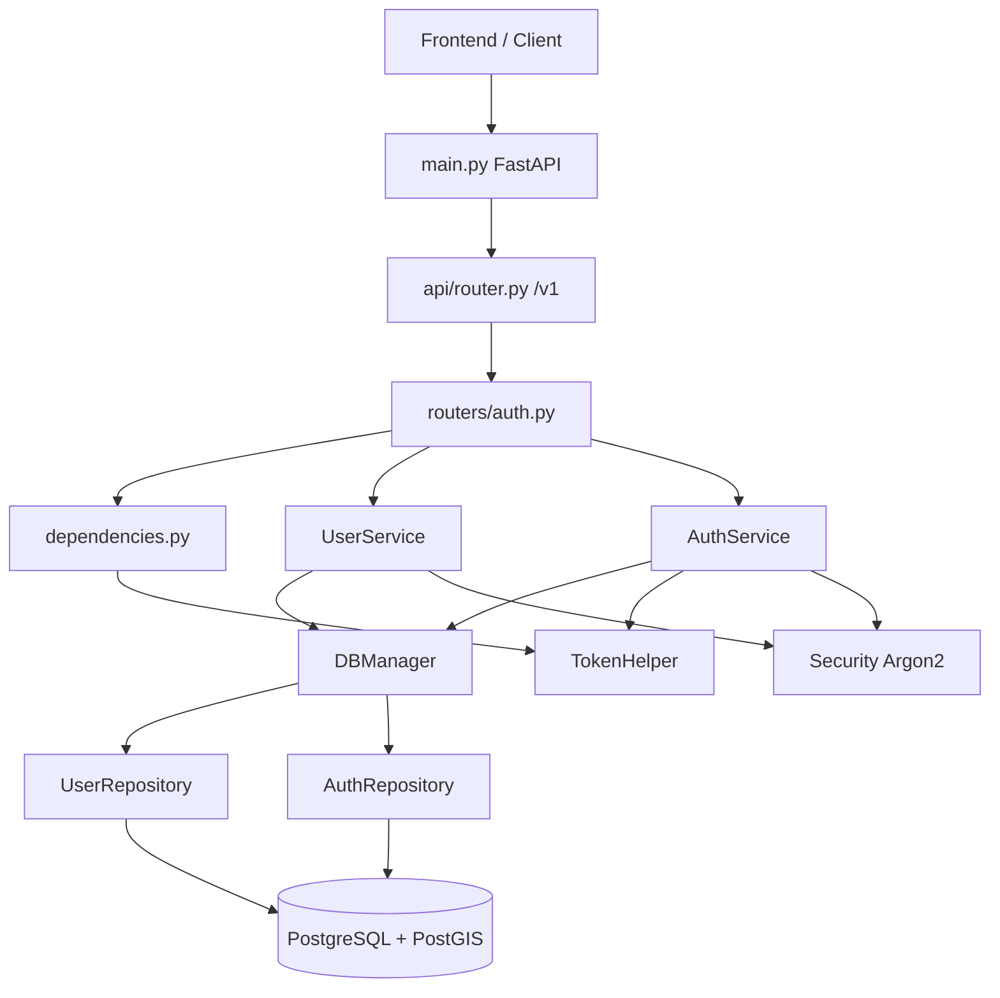

# Backend — Ai4Arctic

REST API для веб-сервиса мониторинга вечной мерзлоты. Backend отвечает за аутентификацию пользователей, хранение геопространственных индексов растительности (NDVI и связанные метрики) и предоставление данных фронтенду.

**Стек:** Python 3.12 · FastAPI · SQLAlchemy 2.x (async) · Alembic · PostgreSQL + PostGIS · JWT (RS256) · Argon2 · uv

---

## Содержание

- [Обзор архитектуры](#обзор-архитектуры)
- [Структура каталогов](#структура-каталогов)
- [Слои приложения](#слои-приложения)
- [Конфигурация](#конфигурация)
- [База данных](#база-данных)
- [Аутентификация и авторизация](#аутентификация-и-авторизация)
- [API](#api)
- [Схемы данных (Pydantic)](#схемы-данных-pydantic)
- [Обработка ошибок](#обработка-ошибок)
- [Запуск и разработка](#запуск-и-разработка)
- [Docker](#docker)
- [Тестирование](#тестирование)
- [CI/CD](#cicd)
- [Зависимости](#зависимости)
- [Текущее состояние и планы](#текущее-состояние-и-планы)

---

## Обзор архитектуры

Приложение построено по классической многослойной схеме:

```
HTTP-запрос
    ↓
FastAPI Router (api/routers/)
    ↓
Service (services/) — бизнес-логика
    ↓
Repository (repositories/) — доступ к данным
    ↓
SQLAlchemy ORM (models/) → PostgreSQL / PostGIS
```

**Точка входа:** `src/main.py` — создаёт экземпляр FastAPI, подключает CORS, регистрирует роутеры и служебные эндпоинты.

**Версионирование API:** все бизнес-эндпоинты находятся под префиксом `/v1` (константа `API_V1_PREFIX`).

**Документация OpenAPI:** автоматически генерируется FastAPI и доступна по адресам `/docs` (Swagger UI) и `/redoc` (ReDoc).

---

## Структура каталогов

```
backend/
│
├── certs/                     # RSA-ключи для JWT (private.pem, public.pem)
│
├── migrations/                # Alembic-миграции
│   ├── versions/              # История изменений схемы БД
│   ├── env.py                 # Конфигурация Alembic (PostGIS-таблицы игнорируются)
│   └── script.py.mako         # Шаблон новых миграций
│
├── src/
│   ├── api/                   # HTTP-слой
│   │   ├── routers/
│   │   │   └── auth.py        # Эндпоинты аутентификации
│   │   ├── constants.py       # API_V1_PREFIX = "/v1"
│   │   ├── dependencies.py    # DI: сессия БД, текущий пользователь
│   │   ├── router.py          # Агрегатор всех роутеров
│   │   └── tags.py            # OpenAPI-теги (Auth, Meta)
│   │
│   ├── core/                  # Ядро приложения
│   │   ├── settings.py        # Настройки из .env (Pydantic Settings)
│   │   ├── security.py        # Хеширование паролей (Argon2), OAuth2 scheme
│   │   ├── tokens.py          # Создание/декодирование JWT, refresh-токены
│   │   └── exceptions.py      # Доменные исключения
│   │
│   ├── db/                    # Подключение к БД
│   │   ├── base.py            # DeclarativeBase
│   │   ├── database.py        # Async engine, sessionmaker, get_session
│   │   └── db_manager.py      # Unit of Work: объединяет репозитории в одну сессию
│   │
│   ├── models/
│   │   └── models.py          # ORM-модели: User, RefreshToken, NDVI
│   │
│   ├── repositories/
│   │   └── repositories.py    # UserRepository, AuthRepository
│   │
│   ├── schemas/
│   │   ├── config.py          # Базовый APIModel (Pydantic)
│   │   └── user.py            # DTO: UserCreate, UserOut, TokenPair и др.
│   │
│   ├── services/
│   │   └── services.py        # UserService, AuthService
│   │
│   └── main.py                # FastAPI app
│
├── tests/
│   ├── test_endpoints/
│   │   └── test_auth.py       # Интеграционные тесты auth-эндпоинтов
│   ├── conftest.py            # Фикстуры: БД, HTTP-клиент, миграции
│   └── test_mapper_config.py  # Проверка валидности ORM-маппингов
│
├── .env.example               # Шаблон переменных окружения
├── alembic.ini                # Конфигурация Alembic
├── Dockerfile                 # Production-образ (multi-stage)
├── Dockerfile.dev             # Dev-образ с hot-reload
├── Makefile                   # revision, head, run
├── pyproject.toml             # Зависимости (uv), ruff, pytest
└── uv.lock                    # Lock-файл зависимостей
```

---

## Слои приложения

### 1. API (`src/api/`)

Отвечает за HTTP-контракт: маршруты, валидацию входных данных, коды ответов, установку cookie.

- `router.py` — подключает `user_auth` с префиксом `/v1`.
- `dependencies.py` — FastAPI Depends:
  - `get_session` — асинхронная сессия SQLAlchemy;
  - `get_db_manager` — контекстный менеджер `DBManager` (сессия + репозитории);
  - `get_current_user` — извлекает access-токен из заголовка `Authorization` или cookie, декодирует JWT, загружает `User` из БД.

### 2. Services (`src/services/`)

Содержит бизнес-логику, не зависящую от HTTP.

| Сервис        | Ответственность |
|---------------|-----------------|
| `UserService` | Регистрация: проверка уникальности имени/email, хеширование пароля |
| `AuthService` | Логин, выпуск пары токенов, ротация refresh-токена |

### 3. Repositories (`src/repositories/`)

Тонкий слой доступа к данным через SQLAlchemy `AsyncSession`.

| Репозиторий      | Методы |
|------------------|--------|
| `UserRepository` | `get_user_name`, `get_user_email`, `get_user_id`, `create_user` |
| `AuthRepository` | `create_refresh_token`, `get_refresh_token`, `delete_refresh_token` |

### 4. DB Manager (`src/db/db_manager.py`)

Паттерн **Unit of Work**: при входе в контекст создаётся одна сессия и инициализируются все репозитории. При выходе — rollback и закрытие сессии (commit выполняется явно в сервисах).

### 5. Models (`src/models/`)

SQLAlchemy 2.x ORM с типизацией `Mapped[...]`.

### 6. Core (`src/core/`)

Инфраструктурные утилиты: настройки, криптография, JWT, доменные исключения.

---

## Конфигурация

Настройки загружаются из файла `.env` через `pydantic-settings` (`src/core/settings.py`). Экземпляр кэшируется через `@lru_cache` в `get_settings()`.

При старте автоматически читаются RSA-ключи JWT с диска (`load_keys()`).

### Переменные окружения

| Группа | Переменная | Описание |
|--------|------------|----------|
| **App** | `PROJECT_NAME` | Название сервиса (отображается в OpenAPI) |
| | `PROJECT_DESCRIPTION` | Описание сервиса |
| | `PROJECT_VERSION` | Версия API |
| **PostgreSQL** | `POSTGRES_SERVER` | Хост БД (`db` в Docker, `localhost` локально) |
| | `POSTGRES_USER` | Пользователь |
| | `POSTGRES_PASSWORD` | Пароль |
| | `POSTGRES_PORT` | Порт (по умолчанию 5432) |
| | `POSTGRES_DB` | Имя базы данных |
| **JWT** | `JWT_PRIVATE_KEY_PATH` | Путь к приватному RSA-ключу |
| | `JWT_PUBLIC_KEY_PATH` | Путь к публичному RSA-ключу |
| | `JWT_ALGORITHM` | Алгоритм подписи (`RS256`) |
| | `ACCESS_TOKEN_EXPIRES_MINUTES` | Время жизни access-токена (мин.) |
| | `REFRESH_TOKEN_EXPIRES_MINUTES` | Время жизни refresh-токена (мин.) |
| | `JWT_ISSUER` | Issuer claim (зарезервировано) |
| | `JWT_AUDIENCE` | Audience claim (зарезервировано) |
| **Cookies** | `ACCESS_COOKIE_NAME` | Имя cookie для access-токена |
| | `REFRESH_COOKIE_NAME` | Имя cookie для refresh-токена |
| | `SESSION_COOKIE_SECURE` | Флаг `Secure` для cookie |
| | `SESSION_COOKIE_DOMAIN` | Домен cookie (опционально) |
| **Frontend** | `FRONTEND_URL` | URL фронтенда для CORS |
| **Тесты** | `TESTCONTAINER` | `True` — поднять PostgreSQL через testcontainers |

### Вычисляемые поля

- `ASYNC_DB_URL` — `postgresql+asyncpg://...` (для приложения)
- `SYNC_DB_URL` — `postgresql+psycopg://...` (для Alembic)

Шаблон: `backend/.env.example`.

---

## База данных

### СУБД

**PostgreSQL 16+ с расширением PostGIS** (`postgis/postgis:16-3.4` в Docker). Используется для хранения геометрий полигонов NDVI.

Драйверы:
- **asyncpg** — асинхронные запросы из приложения;
- **psycopg** — синхронные миграции Alembic.

### Таблицы

#### `users`

| Поле | Тип | Описание |
|------|-----|----------|
| `id` | UUID (PK) | Идентификатор пользователя |
| `name` | VARCHAR(20), UNIQUE | Логин (5–20 символов) |
| `email` | CITEXT, UNIQUE, nullable | Email (регистронезависимый) |
| `password_hash` | VARCHAR(255) | Argon2-хеш пароля |

Расширение `citext` создаётся миграцией для case-insensitive email.

#### `refresh_tokens`

| Поле | Тип | Описание |
|------|-----|----------|
| `id` | UUID (PK) | Идентификатор записи |
| `user_id` | UUID (FK → users.id, CASCADE) | Владелец токена |
| `token_hash` | VARCHAR(128), UNIQUE | SHA-256 хеш refresh-токена |
| `created_at` | TIMESTAMPTZ | Время создания |
| `expires_at` | TIMESTAMPTZ, INDEX | Время истечения |
| `revoked` | BOOLEAN | Флаг отзыва |

Refresh-токен хранится в БД только в виде хеша; сырой токен передаётся клиенту один раз.

#### `ndvi`

| Поле | Тип | Описание |
|------|-----|----------|
| `id` | UUID (PK) | Идентификатор записи |
| `name` | VARCHAR(75) | Название участка/слоя |
| `year` | DATE | Год наблюдения |
| `ndvi` | NUMERIC(7,6) | Normalized Difference Vegetation Index |
| `ndwi_1` | NUMERIC(7,6) | Normalized Difference Water Index (вариант 1) |
| `ndwi_2` | NUMERIC(7,6) | Normalized Difference Water Index (вариант 2) |
| `savi` | NUMERIC(7,6) | Soil-Adjusted Vegetation Index |
| `geom` | GEOMETRY(POLYGON, SRID 4326) | Геометрия полигона (WGS 84) |

> Таблица `ndvi` создана миграциями, но **API для работы с NDVI пока не реализован** — модель есть, репозиторий/сервис/роутер отсутствуют.

### Миграции (Alembic)

История миграций (порядок применения):

| Revision | Описание |
|----------|----------|
| `cddf712fd47d` | Создание таблиц `users` и `ndvi` |
| `5b23dc847679` | Создание таблицы `refresh_tokens` |
| `108895874c39` | Пустая миграция (заглушка) |
| `73af3d064a51` | Добавление `email` (CITEXT), изменение длины `name` до 20 |

Команды:

```bash
make revision m="описание"   # Создать autogenerate-миграцию
make head                    # Применить все миграции (alembic upgrade head)
```

`migrations/env.py` игнорирует системные таблицы PostGIS при autogenerate (`IGNORE_TABLES`).

---

## Аутентификация и авторизация

### Схема токенов

| Токен | Формат | Хранение | TTL |
|-------|--------|----------|-----|
| **Access** | JWT (RS256) | Cookie + тело ответа | `ACCESS_TOKEN_EXPIRES_MINUTES` (15 мин. по умолчанию) |
| **Refresh** | Случайная строка (`secrets.token_urlsafe`) | Cookie + тело ответа + хеш в БД | `REFRESH_TOKEN_EXPIRES_MINUTES` (30 дней по умолчанию) |

### Payload access-токена (JWT)

```json
{
  "sub": "<user_uuid>",
  "type": "access",
  "iat": 1710000000,
  "exp": 1710000900,
  "iss": "<PROJECT_NAME>"
}
```

### Поток аутентификации

```
Регистрация (POST /v1/auth/register)
    → UserService.register()
    → Argon2 hash → INSERT users

Логин (POST /v1/auth/login)
    → AuthService.login()
    → Проверка пароля
    → Выпуск access JWT + refresh token
    → SHA-256(refresh) → INSERT refresh_tokens
    → Set-Cookie + JSON TokenPair

Обновление (POST /v1/auth/token/refresh)
    → AuthService.refresh()
    → Поиск хеша в БД, проверка срока
    → Удаление старого refresh (ротация)
    → Выпуск новой пары токенов

Профиль (GET /v1/auth/me)
    → get_current_user()
    → JWT из Authorization: Bearer или cookie
    → Декодирование → загрузка User
```

### Передача access-токена

Поддерживаются два способа (в порядке приоритета):

1. Заголовок `Authorization: Bearer <token>` (OAuth2PasswordBearer)
2. Cookie `access_token` (имя настраивается)

### Безопасность паролей

- Хеширование: **Argon2** через `passlib`
- Верификация при логине: `security.verify_password()`

---

## API

### Служебные эндпоинты

| Метод | Путь | Тег | Описание |
|-------|------|-----|----------|
| `GET` | `/` | Meta | Статус сервиса |
| `GET` | `/health` | Meta | Health-check для мониторинга |

### Auth (`/v1/auth`)

| Метод | Путь | Auth | Описание | Коды ответа |
|-------|------|------|----------|-------------|
| `POST` | `/v1/auth/register` | — | Регистрация пользователя | `201`, `400`, `422` |
| `POST` | `/v1/auth/login` | — | Вход (OAuth2 form: `username`, `password`) | `200`, `401`, `400` |
| `POST` | `/v1/auth/token/refresh` | — | Ротация токенов | `200`, `401`, `400` |
| `GET` | `/v1/auth/me` | JWT | Профиль текущего пользователя | `200`, `401` |

### Примеры запросов

**Регистрация:**

```http
POST /v1/auth/register
Content-Type: application/json

{
  "name": "arctic_user",
  "email": "user@example.com",
  "password": "secure_pass_1",
  "confirm_password": "secure_pass_1"
}
```

**Ответ (201):**

```json
{
  "id": "550e8400-e29b-41d4-a716-446655440000",
  "name": "arctic_user"
}
```

**Логин:**

```http
POST /v1/auth/login
Content-Type: application/x-www-form-urlencoded

username=arctic_user&password=secure_pass_1
```

**Ответ (200):**

```json
{
  "access_token": "eyJ...",
  "refresh_token": "xK9...",
  "token_type": "bearer"
}
```

Параллельно устанавливаются HTTP-only cookie (см. `_set_token_cookies` в `auth.py`).

**Профиль:**

```http
GET /v1/auth/me
Authorization: Bearer eyJ...
```

---

## Схемы данных (Pydantic)

Базовый класс `APIModel` (`schemas/config.py`):
- `from_attributes=True` — сериализация из ORM-объектов;
- `extra="forbid"` — запрет лишних полей.

| Схема | Назначение | Ключевые поля |
|-------|------------|---------------|
| `UserCreate` | Регистрация | `name` (5–20), `email`, `password` (8–128), `confirm_password` + валидатор совпадения |
| `UserOut` | Ответ с данными пользователя | `id`, `name` (пароль не возвращается) |
| `LoginRequest` | Альтернативная схема логина | `name`, `password` |
| `TokenPair` | Пара токенов | `access_token`, `refresh_token`, `token_type` |
| `RefreshRequest` | Обновление токенов | `refresh_token` |

---

## Обработка ошибок

Доменные исключения определены в `src/core/exceptions.py` и перехватываются в роутерах с маппингом на HTTP-коды:

| Исключение | HTTP-код | Контекст |
|------------|----------|----------|
| `UserAlreadyExistsError` | 400 | Дублирующееся имя при регистрации |
| `EmailAlreadyExistsError` | 400 | Дублирующийся email |
| `InvalidCredentialsError` | 401 | Неверный логин/пароль |
| `RefreshTokenNotFoundError` | 401 | Refresh не найден или отозван |
| `RefreshTokenExpiredError` | 401 | Refresh истёк |
| `UserNotFoundError` | 401 | Пользователь удалён, но токен валиден |
| Pydantic `ValidationError` | 422 | Невалидное тело запроса (автоматически FastAPI) |
| `jwt.ExpiredSignatureError` | 401 | Access-токен истёк |
| `jwt.InvalidTokenError` | 401 | Невалидный access-токен |

---

## Запуск и разработка

### Требования

- Python 3.12+
- [uv](https://docs.astral.sh/uv/) — менеджер пакетов
- PostgreSQL + PostGIS
- RSA-ключи в `backend/certs/` (`private.pem`, `public.pem`)

### Локальный запуск

```bash
cd backend
cp .env.example .env          # Настроить переменные
uv sync                        # Установить зависимости
make run                       # Миграции + uvicorn на :8080
```

`make run` выполняет `alembic upgrade head`, затем запускает:

```
uvicorn src.main:app --host 0.0.0.0 --port 8080
```

### Dev-режим с hot-reload

```bash
# Через Dockerfile.dev или напрямую:
uvicorn src.main:app --host 0.0.0.0 --port 8080 --reload
```

### Через Docker Compose (из корня репозитория)

```bash
cp backend/.env.example backend/.env
docker compose --env-file ./backend/.env up --build
```

Сервисы: `db` (PostGIS) + `backend` (порт 8080).

### Линтинг

```bash
uvx ruff check .
uvx ruff format --check .
```

Настройки ruff в `pyproject.toml`: правила E, F, I, N, W, B; игнорируются E501, N802.

---

## Docker

### Production (`Dockerfile`)

Multi-stage сборка:
1. **builder** — `uv sync --frozen --no-dev`, компиляция зависимостей;
2. **runtime** — slim-образ Python 3.12, только `.venv` и исходники.

- Порт: `8080`
- CMD: `make run` (миграции + uvicorn)
- `PYTHONPATH=/app/src`

### Development (`Dockerfile.dev`)

Одностадийный образ с `uv sync` (включая dev-зависимости) и `--reload`.

---

## Тестирование

Фреймворк: **pytest** + **pytest-asyncio** + **httpx** (ASGI transport).

### Фикстуры (`tests/conftest.py`)

| Фикстура | Описание |
|----------|----------|
| `postgres_container` | Testcontainers PostgreSQL (если `TESTCONTAINER=True`) |
| `apply_migrations` | Накат/откат Alembic до `head` / `base` |
| `engine` | Async SQLAlchemy engine |
| `clean_db` | Очистка всех таблиц перед каждым тестом |
| `db_session` | Тестовая сессия с rollback |
| `async_client` | HTTP-клиент с подменой `get_session` |
| `valid_user_data` | Валидный payload регистрации |

### Запуск

```bash
cd backend
uv sync --dev
uv run pytest -vv
```

### Покрытие

- `test_auth.py` — регистрация (успех, дубликат, валидация 422)
- `test_mapper_config.py` — валидность ORM-маппингов SQLAlchemy

В CI используется сервис `postgis/postgis:16-3.4` (GitHub Actions), `TESTCONTAINER=False`.

---

## CI/CD

Workflow: `.github/workflows/backend-ci.yml`

Триггеры: push/PR в ветки `backend`, `main`, `development` при изменениях в `backend/**`.

### Jobs

| Job | Описание |
|-----|----------|
| `ruff` | Линтинг и проверка форматирования |
| `tests-ci` | Миграции Alembic + `alembic check` + pytest на PostGIS |
| `dockerfile-ci` | Сборка production Docker-образа |
| `docker-compose-ci` | Отключён (`if: false`) — smoke-тест compose |

JWT-ключи в CI подставляются из GitHub Secrets (`JWT_PRIVATE_KEY`, `JWT_PUBLIC_KEY`).

---

## Зависимости

### Production (`pyproject.toml`)

| Пакет | Назначение |
|-------|------------|
| `fastapi` | Web-фреймворк |
| `uvicorn` | ASGI-сервер |
| `sqlmodel` / SQLAlchemy | ORM |
| `asyncpg`, `psycopg` | Драйверы PostgreSQL |
| `alembic` | Миграции |
| `pydantic-settings` | Конфигурация |
| `passlib[argon2]` | Хеширование паролей |
| `pyjwt[crypto]` | JWT RS256 |
| `email-validator` | Валидация email |
| `geoalchemy2`, `geopandas` | Геопространственные данные |
| `python-multipart` | OAuth2 form (login) |
| `redis` | Зарезервирован (пока не используется в коде) |

### Dev

| Пакет | Назначение |
|-------|------------|
| `httpx` | HTTP-клиент для тестов |
| `pytest-asyncio` | Асинхронные тесты |
| `pytest-dotenv` | Загрузка `.test.env` |
| `testcontainers[postgresql]` | Изолированная БД в тестах |

---

## Текущее состояние и планы

### Реализовано

- Регистрация и аутентификация пользователей (JWT + refresh с ротацией)
- Хранение refresh-токенов в БД (хеш SHA-256)
- CORS для фронтенда
- Схема БД для геоданных NDVI (PostGIS)
- Миграции Alembic с поддержкой PostGIS
- Интеграционные тесты auth-эндпоинтов
- CI: линтинг, тесты, сборка Docker

### Не реализовано / в разработке

- **API для NDVI** — модель и таблица есть, но нет эндпоинтов для чтения/записи геоданных
- **Redis** — зависимость добавлена, интеграция отсутствует
- **geopandas** — подключён для будущей обработки геоданных
- **Logout / отзыв токенов** — нет эндпоинта выхода
- **Эндпоинты анализа мерзлоты** — основная бизнес-логика проекта (см. `notebooks/`)

### CORS

Разрешён только один origin — `FRONTEND_URL` из настроек. Credentials включены (`allow_credentials=True`).

---

## Диаграмма компонентов


